# ProceduralWorld 功能模块流程图说明

这份文档用于答辩讲解。项目本质上是一个基于 C++17、OpenGL 4.1、GLFW、GLAD、GLM、ImGui 和 xmake 的实时程序化星球渲染系统。当前代码的主线是：先在 CPU 端生成六个 cube face 的 DEM/高度场数据，再烘焙成地形 chunk 和多张 GPU texture array，运行时按相机位置做可见性裁剪、绘制地形、海洋、反射折射、大气和体积云。

需要注意：当前 `PlanetProceduralData::generate()` 会直接进入 `generateDemPrototype()` 并返回，所以实际运行的是 DEM 原型生成路径。后面保留的旧版分模块生成代码目前不会执行。

## 1. 项目总体流程

主要代码位置：

| 模块 | 代码 |
| --- | --- |
| 程序入口、窗口、输入、ImGui | `src/main.cpp` |
| 星球渲染主流程 | `src/PlanetRenderer.cpp`, `include/PlanetRenderer.h` |
| CPU 程序化星球数据 | `src/PlanetProceduralData.cpp`, `include/PlanetProceduralData.h` |
| FFT 海洋 | `src/FFTOcean.cpp`, `include/FFTOcean.h` |
| 地形、海洋、大气 shader | `shaders/` |
| 构建脚本 | `xmake.lua` |
| 高度诊断工具 | `tools/TerrainHeightDiagnostics.cpp` |

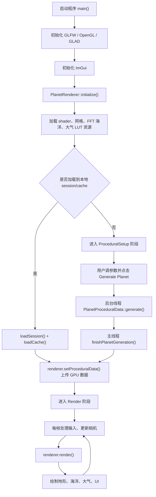

讲解要点：

- `main.cpp` 管理应用状态、输入、UI、生成线程和本地 session/cache。
- `PlanetRenderer` 只在主线程持有 OpenGL 资源，后台线程只生成 CPU 数据。
- `xmake.lua` 会把 `shaders/` 和 `assets/` 复制到构建输出目录。

## 2. 应用状态与生成线程

当前项目分三种工作流阶段：

| 阶段 | 含义 |
| --- | --- |
| `ProceduralSetup` | 参数设置界面，还没有进入实时渲染 |
| `Generating` | 后台线程生成星球数据 |
| `Render` | 数据已经上传 GPU，每帧实时渲染 |

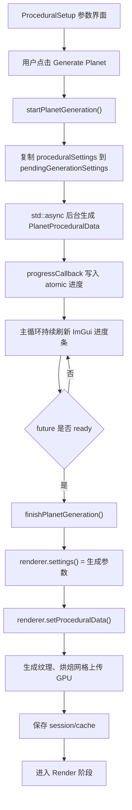

讲解要点：

- 后台线程不能直接创建 OpenGL texture 或 buffer，因为 OpenGL context 在主线程。
- 因此生成完成后，主线程通过 `renderer.setProceduralData()` 上传 GPU 资源。
- `saveSession()` 会保存 UI 参数和二进制 procedural cache；下次启动可直接加载。

## 3. DEM 程序化地形生成

实际入口：`PlanetProceduralData::generate()` -> `generateDemPrototype()`。

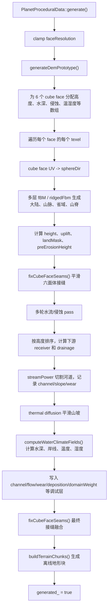

讲解要点：

- 星球不是平面地形，而是六个 cube face 映射到球面。
- 高度值是归一化地形高度，最终几何半径为 `planetRadius + height * terrainHeightScale`。
- `uplift` 表示造山/隆升区域，后面影响网格密度、材质和调试 mask。
- 当前 DEM 路径会生成河道相关 mask，但初次生成末尾会清空并跳过 `terrainFeatureSegments_`；cache 加载时会调用 `buildTerrainFeatureSegments()` 重建特征线。

## 4. 六面体星球与接缝处理

代码位置：

- `PlanetProceduralData::cubeSphereDirection()`
- `PlanetProceduralData::neighborCell()`
- `PlanetProceduralData::fixCubeFaceSeams()`
- `shaders/planet_sampling.glsl`

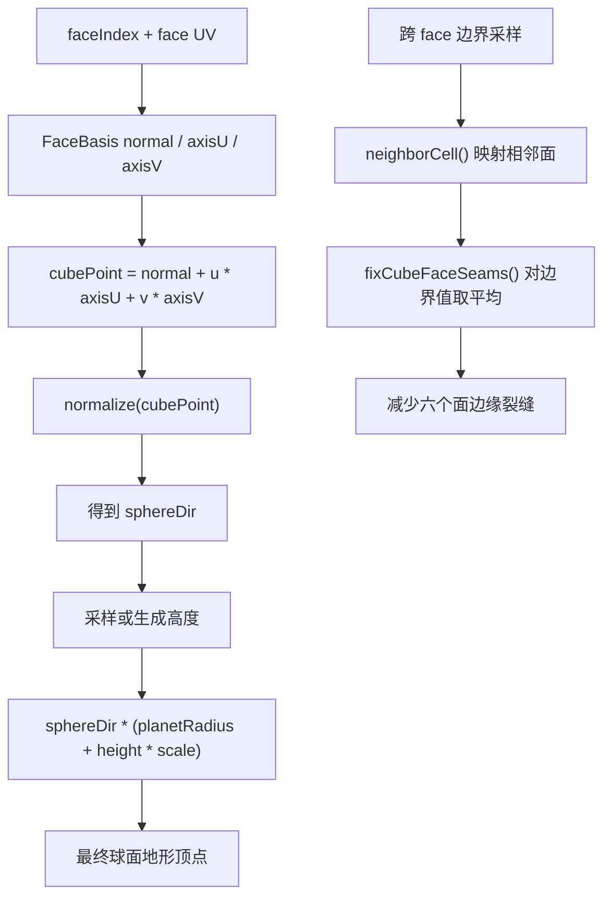

讲解要点：

- 这样避免经纬球在两极三角形密集和 UV 拉伸严重的问题。
- 六个面之间的高度、温湿度、侵蚀、biome/domain 权重都会做 seam reconcile。

## 5. 水文、侵蚀和河道 mask

代码位置：

- `generateDemPrototype()`
- `computeWaterClimateFields()`
- `terrain_surface.glsl`

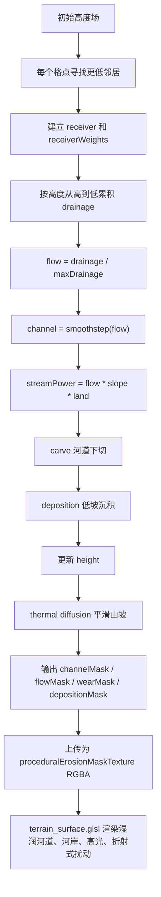

讲解要点：

- 这里不是完整流体模拟，而是适合程序化地形的网格近似侵蚀。
- `channelMask` 和 `flowMask` 不只是显示颜色，也会参与材质混合、湿润河岸和河道高光。
- UI 中的 Hydrology Debug 控制的是湿润通道/河道视觉表现，不会实时重算 CPU 地形。

## 6. 温湿度、材质和地表分类

代码位置：

- `computeWaterClimateFields()`
- `PlanetProceduralData::FaceData`
- `shaders/terrain_surface.glsl`
- `shaders/terrain_lighting.glsl`

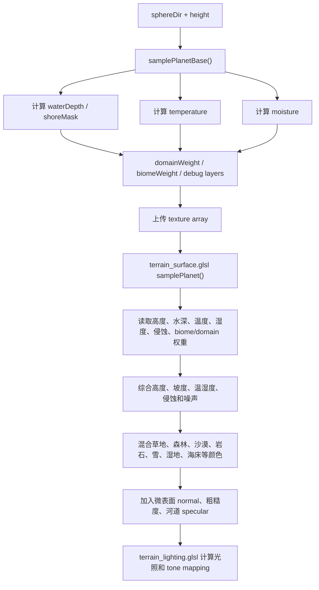

讲解要点：

- 当前是 procedural material blending，不是加载多套真实地表贴图做传统 texture splatting。
- 地表颜色来自多因子混合：高度、坡度、温度、湿度、海岸、水深、侵蚀和噪声。
- `renderMode` 可切换 Shaded、Unshaded、HeightMap、Normals、Material 等调试视图。

## 7. 地形 chunk 烘焙与 Baked LOD

代码位置：

- `PlanetProceduralData::buildTerrainChunks()`
- `PlanetRenderer::BakedTerrainMesh::upload()`
- `PlanetRenderer::buildVisibleBakedChunks()`
- `PlanetRenderer::drawBakedTerrainPass()`

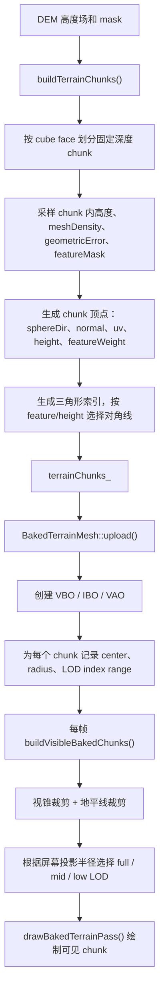

讲解要点：

- 当前地形主路径是 baked chunks，不是每帧对地形 patch 做 tessellation。
- 性能面板显示 `Baked chunks: visible / total` 和 full/mid/low LOD 数量。
- `drawWireOverlayPass()` 中的 Baked LOD 模式可显示地形块线框。

## 8. CPU 数据到 GPU 的上传

代码位置：`PlanetRenderer::setProceduralData()`。

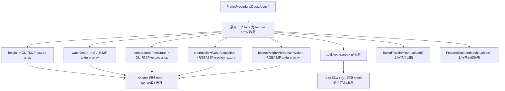

讲解要点：

- texture array 的 layer 对应 6 个 cube face。
- 侵蚀数据打包为 RGBA：R=channel，G=flow，B=wear，A=deposition。
- 前缀和用于快速判断海洋 patch 是否需要绘制或强制提高海岸 LOD。

## 9. 海洋 patch LOD 与球面海面

代码位置：

- `buildVisibleOceanPatches()`
- `collectVisibleOceanPatches()`
- `shouldSplitNode()`
- `analyzePatchWaterCoverage()`
- `shaders/ocean.tesc`, `shaders/ocean.tese`

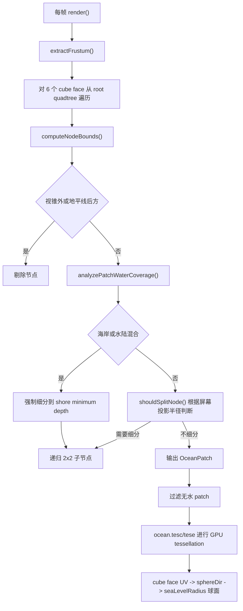

讲解要点：

- 海洋仍使用 quadtree patch + GPU tessellation。
- 海岸线区域会更细，因为水陆交界最容易暴露几何和材质问题。
- `updateOceanTessellationBudget()` 会根据 patch 数动态调节预算，避免水面 patch 过多。

## 10. FFT 海浪

代码位置：

- `FFTOcean::initialize()`
- `FFTOcean::buildInitialSpectrum()`
- `FFTOcean::update()`
- `FFTOcean::uploadTextures()`
- `shaders/ocean.tese`, `shaders/ocean.frag`

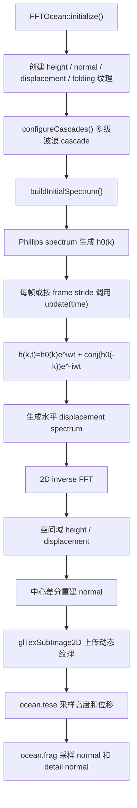

讲解要点：

- FFT ocean 是频域海浪近似，不是 Navier-Stokes 流体求解。
- 多个 cascade 用不同 patchLength、振幅和速度覆盖大浪、中浪、细浪。
- shader 用 triplanar 投影把 2D FFT 纹理贴到球面海洋上，减少球面 UV 拉伸。

## 11. 海洋材质、反射、折射和水深混合

代码位置：

- `drawReflectionRefractionPasses()`
- `drawOceanPass()`
- `shaders/ocean.frag`

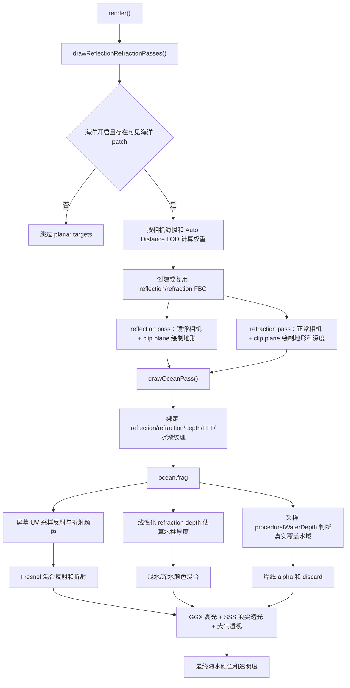

讲解要点：

- 反射折射是 planar approximation，以海平面高度为镜像基准。
- 对球面星球来说这不是严格曲面光线追踪，但实时效果和性能更合适。
- 水色同时使用屏幕深度和程序化水深，近处边缘更稳定，远处覆盖更完整。

## 12. 大气散射 LUT 与天空

代码位置：

- `AtmosphereLut::create()`
- `computeAtmosphereLutSignature()`
- `precomputeAtmosphereLuts()`
- `drawAtmospherePass()`
- `shaders/atmosphere_*.frag`
- `shaders/atmosphere.frag`

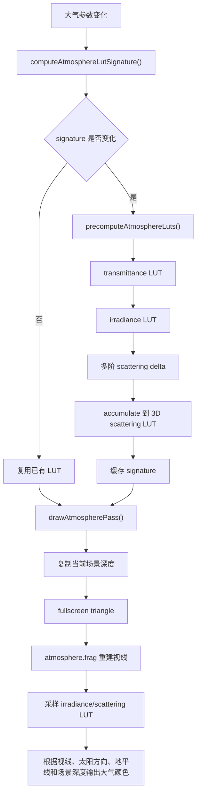

讲解要点：

- 当前大气是 LUT-backed scattering，不是简单天空盒图片。
- 大气参数改变才重建 LUT，避免每帧重复昂贵预计算。
- `sceneDepthTexture` 用于让大气和已有地形/海洋深度关系更自然。

## 13. 程序化体积云

新增重点代码位置：

- `PlanetRenderSettings` 中 `renderClouds`、`cloudCoverage`、`cloudStepCount` 等参数
- `drawAtmospherePass()` 传入云层 uniform
- `shaders/atmosphere.frag`
- `main.cpp` 的 Clouds UI 面板

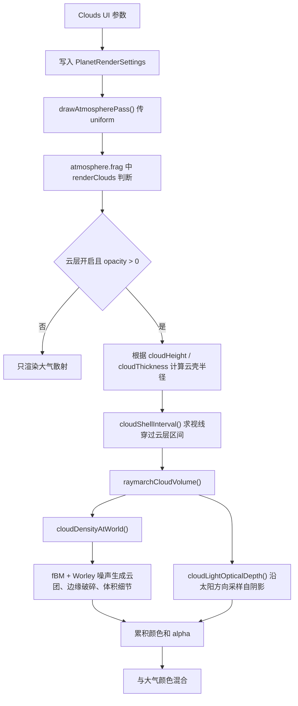

讲解要点：

- 云不是贴图，而是在大气 pass 中对云壳做 raymarch。
- 形状由 fBM、Worley、coverage、sharpness、scale、speed 控制。
- `cloudStepCount` 和 `cloudLightStepCount` 是质量/性能权衡参数。

## 14. 调试、可视化和性能面板

代码位置：

- `drawRenderPanel()`
- `drawPerformancePanel()`
- `drawWireOverlayPass()`
- `terrain_debug.glsl`
- `feature_segments.vert/frag`

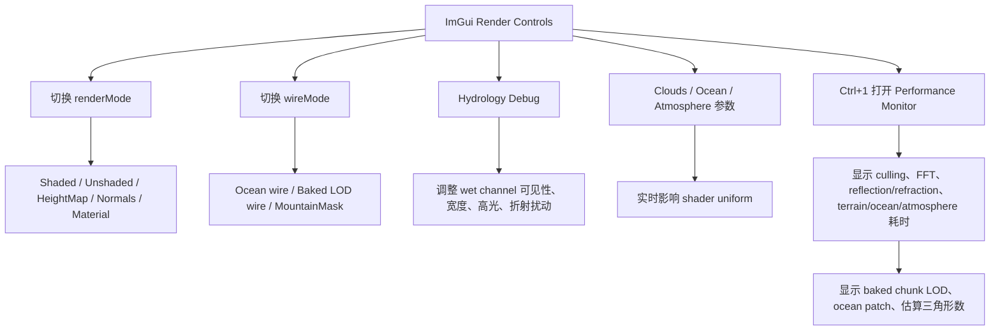

特征线 overlay 当前状态：

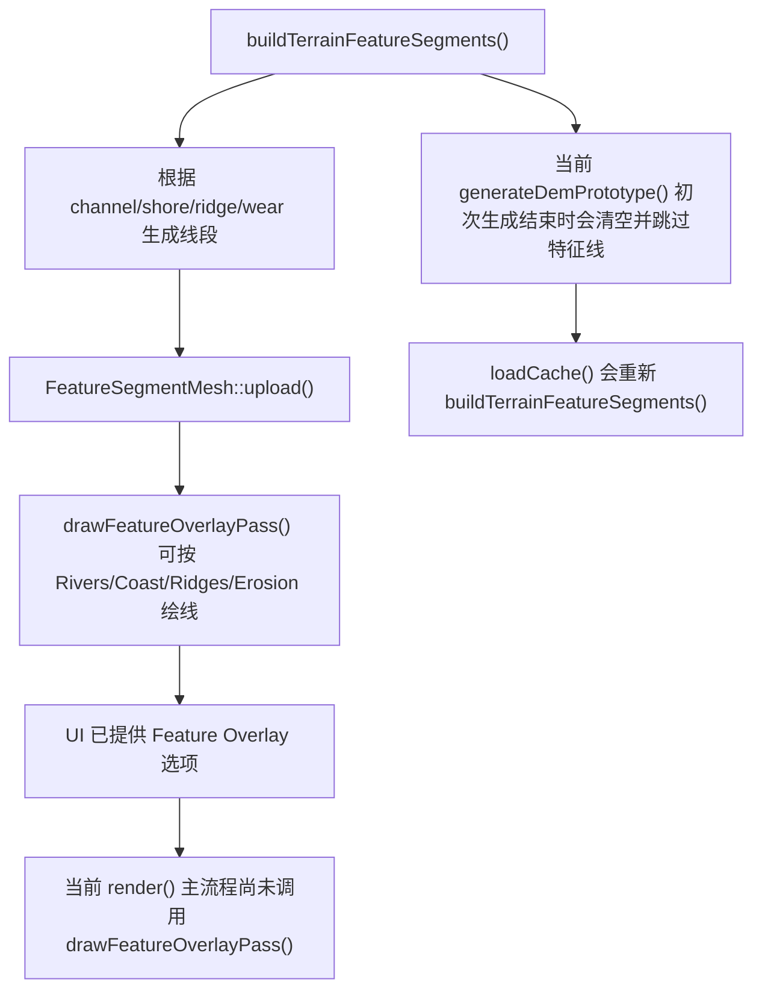

讲解建议：

- 已实现的稳定调试能力：render mode、wire mode、性能面板、湿润河道 overlay。
- 特征线 overlay 代码已具备，但当前主帧路径和 DEM 初次生成路径没有完全接入；如果演示需要，需要在 `render()` 中调用 `drawFeatureOverlayPass()` 并避免初次生成时清空线段。

## 15. 输入和相机控制

代码位置：

- `FlyCamera.h`
- `onMouseScrolled()`
- `onMouseMoved()`
- `onKeyPressed()`
- `handleKeyboardMovement()`

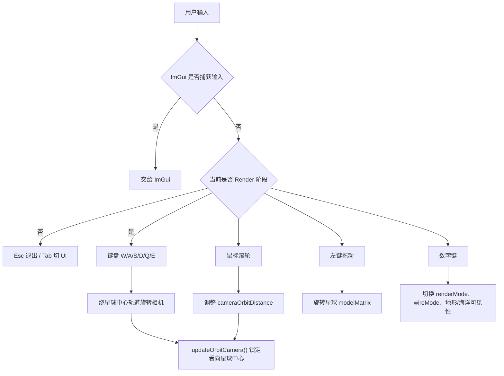

讲解要点：

- 当前不是普通自由飞行，而是围绕星球中心的轨道观察模式。
- FOV 固定，滚轮改变轨道距离，保证观察星球时比例稳定。

## 16. Shader 编译和资源管理

代码位置：

- `ShaderProgram.h`
- `PlanetRenderer::initialize()`
- `xmake.lua`

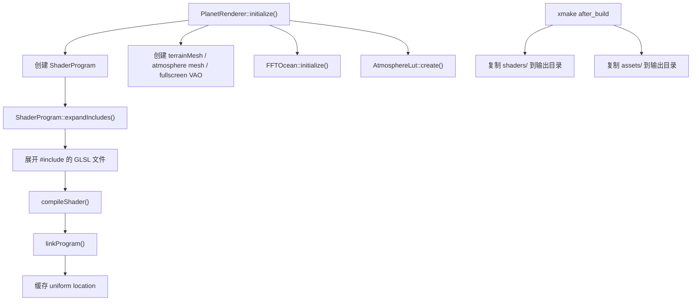

讲解要点：

- shader 支持轻量 `#include`，所以 `terrain_chunk.frag` 可以复用 `terrain_surface.glsl`、`terrain_lighting.glsl` 等。
- uniform location 有缓存，减少每帧大量 draw call 中的 `glGetUniformLocation` 开销。

## 17. 高度诊断工具

代码位置：`tools/TerrainHeightDiagnostics.cpp`，xmake target 为 `TerrainHeightDiagnostics`。

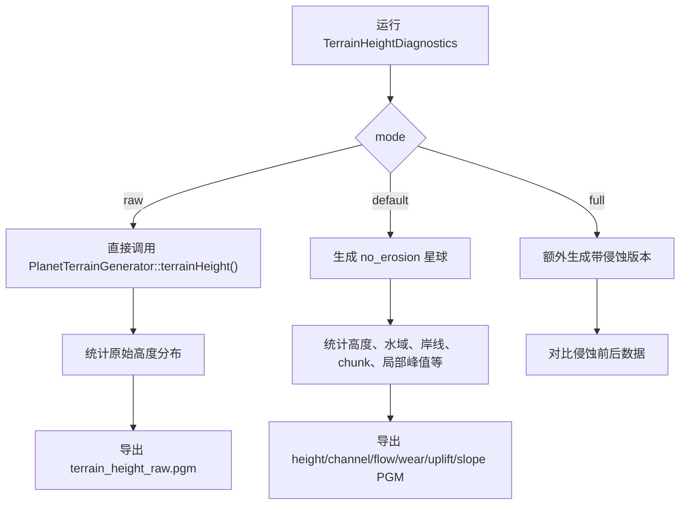

讲解要点：

- 这个工具用于证明程序化地形不是只看画面，而是能导出和分析中间数据。
- 可以辅助回答老师关于高度分布、侵蚀效果和局部噪声是否合理的问题。

## 18. 推荐答辩讲解顺序

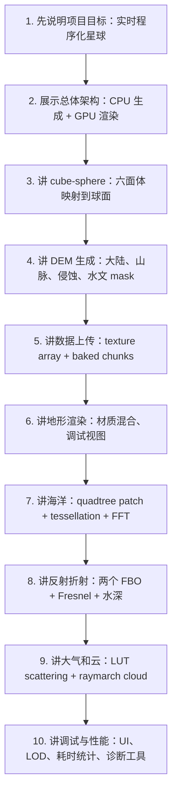

## 19. 不要过度宣称的点

| 不建议说 | 更稳的说法 |
| --- | --- |
| 完整真实地球气候模拟 | 基于纬度、海拔、水域、噪声和水文修正的程序化近似 |
| 完整物理海洋 | 实时 FFT ocean 频域海浪近似 |
| 光线追踪反射 | 基于 FBO 的 planar reflection/refraction |
| 完整 texture splatting | 基于高度、坡度、温湿度、侵蚀和权重的 procedural material blending |
| GPU compute 侵蚀 | CPU 网格近似水文侵蚀和热扩散 |
| 特征线 overlay 已完整演示 | 已有提取和绘制代码，但当前主 render 未接入，初次 DEM 生成也会跳过线段 |

## 20. 一分钟总结版本

这个项目实现了一个实时程序化星球渲染系统。它用 cube-sphere 把星球拆成六个面，在 CPU 上生成 DEM 高度场、水深、岸线、侵蚀、河道、温湿度和材质权重，再上传成 OpenGL texture array，同时烘焙地形 chunk 用于实时渲染。运行时，地形使用 baked chunk LOD 和 shader 材质混合；海洋使用 quadtree patch、GPU tessellation 和 CPU FFT 生成的动态波浪纹理，并通过反射/折射 FBO、水深混合和 Fresnel 做水面效果；大气使用 LUT-backed scattering，云层在大气 pass 中做体积 raymarch。ImGui 提供生成参数、渲染参数、调试视图和性能统计，工具程序还能导出高度和侵蚀诊断图。
